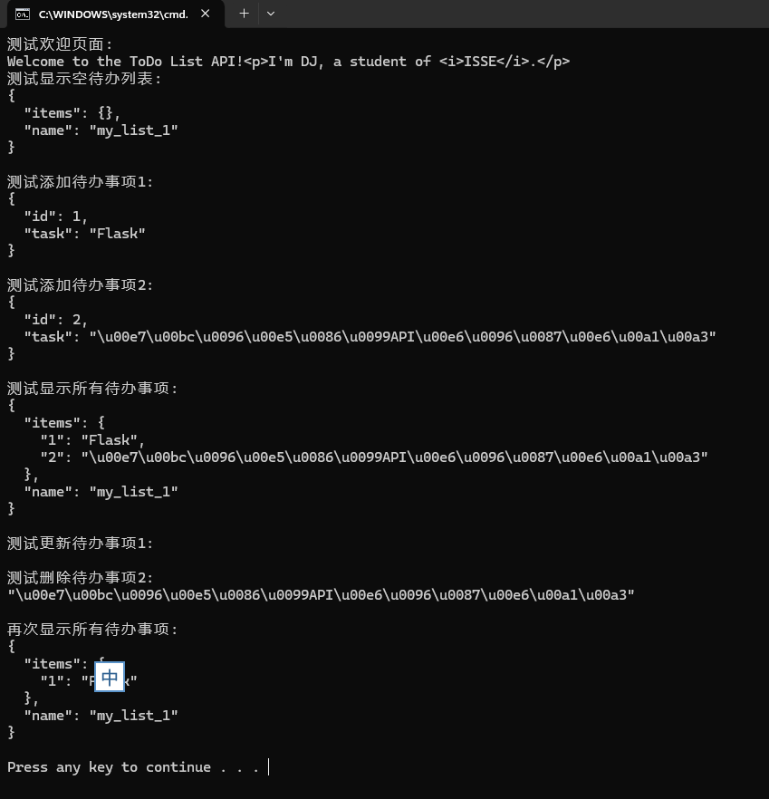

# ToDo List API 文档

## 基础信息
- 基础URL: `http://localhost:5000`
- 返回格式: JSON/String


## 端点(Endpoints)

### 1. 欢迎页面
- **URL**: `/` 或 `/index`
- **方法**: GET
- **描述**: 返回欢迎信息
- **示例响应**:
  ```html
  Welcome to the ToDo List API!<p>I'm DJ, a student of <i>ISSE</i>.</p>
  ```

### 2. 显示所有待办事项
- **URL**: `/show_todos`
- **方法**: GET 或 POST
- **描述**: 返回当前所有待办事项
- **响应格式**:
  ```json
  {
    "name": "my_list_1",
    "items": {
      "1": "任务1",
      "2": "任务2"
    }
  }
  ```
- **空列表响应**:
  ```json
  {
    "name": "my_list_1",
    "items": "这是一个空列表"
  }
  ```

### 3. 添加待办事项
- **URL**: `/add_todo`
- **方法**: GET 或 POST
- **参数**:
  - `task`: (必需) 待办事项内容
- **成功响应**:
  ```json
  {
    "id": 3,
    "task": "新任务"
  }
  ```
- **错误响应**:
  ```json
  {
    "error": "Invalid input"
  }
  ```

### 4. 删除待办事项
- **URL**: `/remove_todo`
- **方法**: GET 或 POST
- **参数**:
  - `id`: (必需) 待办事项ID(整数)
- **成功响应**:
  ```json
  {
    "poped_id": "被删除的任务id"
  }
  ```
- **错误响应**:
  ```json
  {
    "error": "Invalid input"
  }
  或
  {
    "error": "List not found, please check list name or initialize a todolist first."
  }
  ```

### 5. 更新待办事项
- **URL**: `/update_todo`
- **方法**: GET 或 POST
- **参数**:
  - `id`: (必需) 待办事项ID(整数)
  - `task`: (必需) 更新后的任务内容
- **成功响应**:
  ```json
  {
    "id": "更新的任务id",
    "task": "更新后的任务内容"
  }
  ```
- **错误响应**:
  ```json
  {
    "error": "Invalid input"
  }
  或
  {
    "error": "List not found, please check list name or initialize a todolist first."
  }
  ```

## 测试

   ```bash
   cd "....\isse-labs\lab2-doc\丁健-2300016653" # 切换到项目目录
   python app.py # 启动falsk服务
   # 新建一个命令行窗口，执行测试脚本
   ./test_todo_api.bat
   ```
